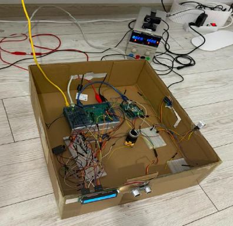
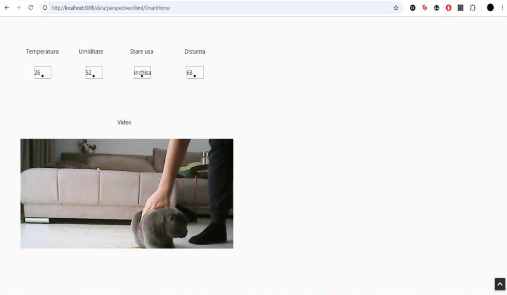
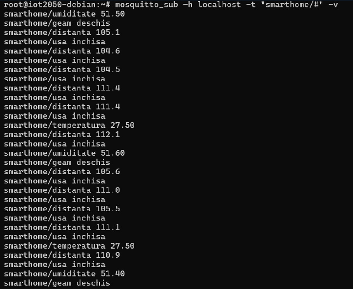

# Smart Home IIoT System

An intelligent home automation system that automatically controls the door and window based on sensor data, monitors temperature and humidity, includes safety features, provides live video monitoring, and exposes the full system state through a real-time SCADA dashboard — built on the industrial Siemens SIMATIC IOT2050 platform.

> Academic project — Politehnica University of Timișoara, Faculty of Automation and Computer Science

---

## Demo

[▶ Watch the full demo on YouTube](https://youtu.be/Di6Y5YMmRn8)

---

## Screenshots

### Hardware Setup


### Ignition Perspective SCADA Dashboard


### MQTT Live Data (mosquitto_sub)


---

## System Architecture

```
HC-SR04 (ultrasonic) ──┐
DHT22 ── Arduino ───────┤
Servo SG90 x2 ─────────┤
LCD 16x2 I2C ──────────┼──► Siemens SIMATIC IOT2050 (Debian Linux)
LED ────────────────────┤         │               │
E-Stop LA38 ────────────┘      MQTT           OPC-UA
                             (port 1883)     (port 4840)
                                 │               │
                                 └───────┬───────┘
                                         ▼
                              Ignition Perspective SCADA
                              (accessible from any device on LAN)
```

**Data flow:** Sensors → IOT2050 Python control logic → MQTT broker (Mosquitto) + OPC-UA server → Ignition Maker Edition dashboard (OPC Client)

**Video stream:** Webcam → ffmpeg HLS → embedded in Ignition dashboard

---

## Features

### Automation Logic
- **Door control** — HC-SR04 ultrasonic sensor (pins D9/D10) reads distance every 5 readings averaged for accuracy. If distance < 10 cm, Servo SG90 opens the door to 90° and triggers the presence LED.
- **Window control** — DHT22 monitors humidity. If humidity > 60%, Servo SG90 closes the window. Default state is open.
- **LCD display** — Custom 16x2 LCD driver written from scratch in GPIO 4-bit mode. Cycles every 10 seconds between three screens: Temp/Humidity → Distance/Door → Window State.

### Safety Mechanisms
- **E-Stop (LA38 button)** — Wired as normally-closed (NC) on pin D1. Uses a hardware GPIO interrupt (ISR) on the rising edge. On first press: immediately disables both servos, turns off LEDs, publishes `ESTOP` alarm on MQTT, and displays `"E-STOP ACTIVAT"` on LCD. On second press: resets the system.
- **Hardware Watchdog Timer** — K3 RTI Watchdog with 60s timeout. A dedicated Python thread writes to `/dev/watchdog` every 10s. Prevents silent script hangs from leaving actuators in an undefined state.

### Communications & SCADA
- **MQTT** — Mosquitto broker on port 1883. Topics: `smarthome/temperatura`, `smarthome/umiditate`, `smarthome/distanta`, `smarthome/usa`, `smarthome/geam`, `smarthome/alarm`.
- **OPC-UA** — Native server on `opc.tcp://0.0.0.0:4840/smarthome`. Exposes all system variables as writable nodes.
- **Ignition Perspective** — Ignition Maker Edition acts as OPC Client, displaying live sensor data and alarm state. Accessible from any browser on the LAN.
- **Live video** — ffmpeg HLS stream embedded directly in the Ignition dashboard for real-time webcam monitoring.

### Embedded Workarounds
- **Arduino serial bridge** — DHT22 requires precise microsecond timing that the IOT2050's Linux scheduler cannot guarantee reliably. An Arduino reads the DHT22 and forwards data via USB serial to the IOT2050.
- **ffmpeg HLS streaming** — Used instead of MJPEG for cross-device browser compatibility.

---

## Hardware Components

| Component | Role |
|-----------|------|
| Siemens SIMATIC IOT2050 | Central gateway, runs all control logic |
| HC-SR04 | Ultrasonic distance sensor for door detection (pins D9/D10) |
| DHT22 + Arduino | Temperature & humidity sensor via serial bridge |
| Servo SG90 x2 | Mechanical door and window control (PWM) |
| LCD 16x2 I2C | Local status display |
| LED | Presence indicator (on when door opens) |
| E-Stop LA38 | Emergency stop button (NC contact, pin D1) |
| Webcam | Live video feed via ffmpeg HLS |
| 12V DC PSU + 5V regulator | Power supply for all components |

---

## Tech Stack

| Layer | Technology |
|-------|-----------|
| Hardware platform | Siemens SIMATIC IOT2050 (Debian Linux) |
| Control logic | Python 3, mraa library |
| Messaging | MQTT (Eclipse Mosquitto) |
| Industrial protocol | OPC-UA (opcua Python library) |
| SCADA | Ignition Maker Edition — Perspective module |
| Video streaming | ffmpeg HLS |
| Arduino bridge | Arduino (DHT22 serial reader) |

---

## Project Structure

```
smart-home-iiot/
├── main.py               # Main control loop (sensors, servos, LCD, MQTT, OPC-UA)
├── arduino/
│   └── dht22_bridge.ino  # Arduino sketch — reads DHT22, sends via serial
├── docs/
│   ├── hardware-setup.jpg
│   ├── scada-dashboard.png
│   └── mqtt-test.png
└── README.md
```

> Note: Ignition Perspective project files are not included as they require Ignition Maker Edition to run.

---

## Setup

### Prerequisites
- Siemens SIMATIC IOT2050 running Debian Linux
- Python 3 with `mraa`, `paho-mqtt`, `opcua` libraries
- Eclipse Mosquitto MQTT broker installed and running on port 1883
- Ignition Maker Edition installed (for SCADA dashboard)
- Arduino IDE (for DHT22 bridge sketch)
- ffmpeg installed on IOT2050

### Run

```bash
# Install dependencies
pip3 install paho-mqtt opcua

# Start MQTT broker (if not running as a service)
mosquitto -d

# Run the main control script
python3 main.py
```

### Monitor MQTT topics
```bash
mosquitto_sub -h localhost -t "smarthome/#" -v
```

---

## Troubleshooting Notes

- **DHT22 on Linux SBCs**: Adafruit_DHT and direct GPIO bit-banging fail on IOT2050 
  (non-RT kernel can't guarantee the microsecond timing DHT22 needs). Arduino serial 
  bridge was the only reliable fix.
- **MJPEG vs HLS**: `motion`'s MJPEG stream works on desktop browsers but fails on iOS 
  Safari ("response could not be parsed"). Switched to ffmpeg HLS for cross-device support.
- **Network on eno2**: DHCP client occasionally fails to bind after reboot; static IP + 
  manual gateway/DNS in `/etc/network/interfaces` is more reliable.
- **Distance sensor noise**: Raw HC-SR04 readings fluctuate ±50cm due to reflections. 
  Averaging 5 readings with outlier filtering (0-200cm range) stabilized output significantly.

## Authors

- Adrian-Ștefan Zemora
- Andrei-Valentin Bîrzu
